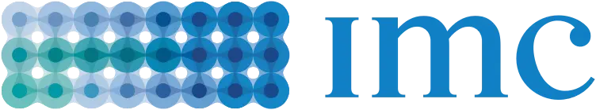
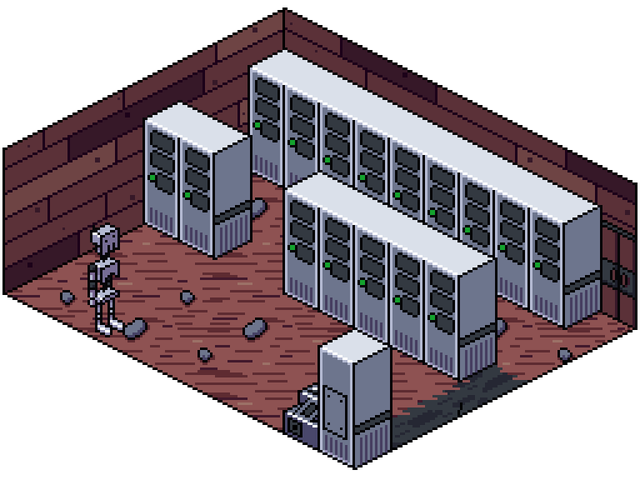
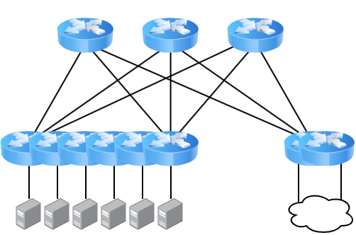
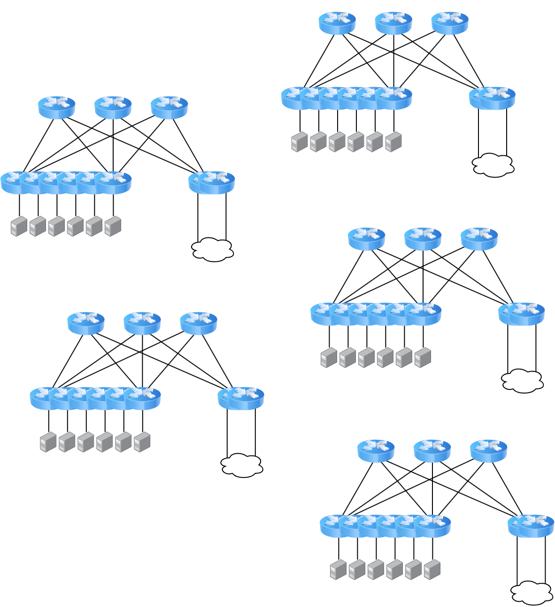
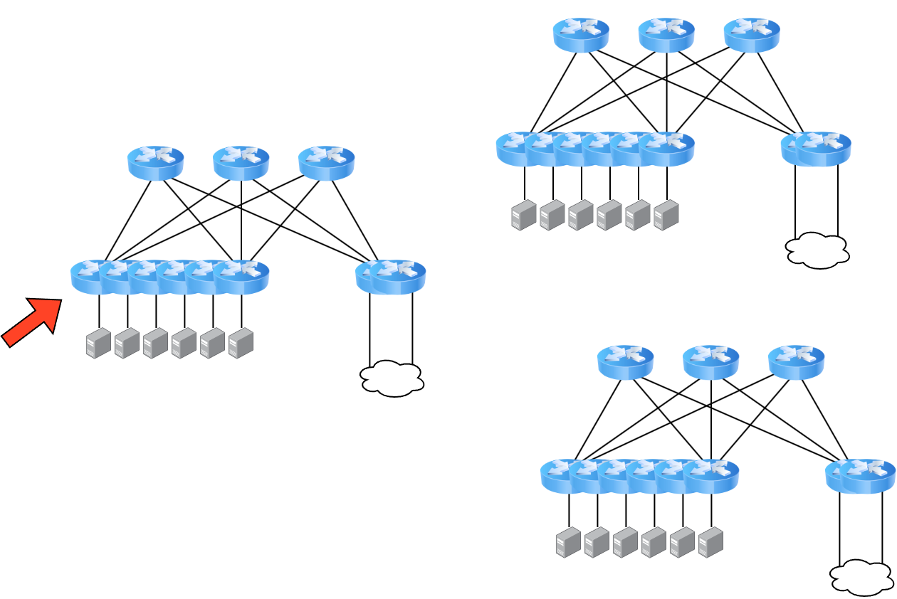
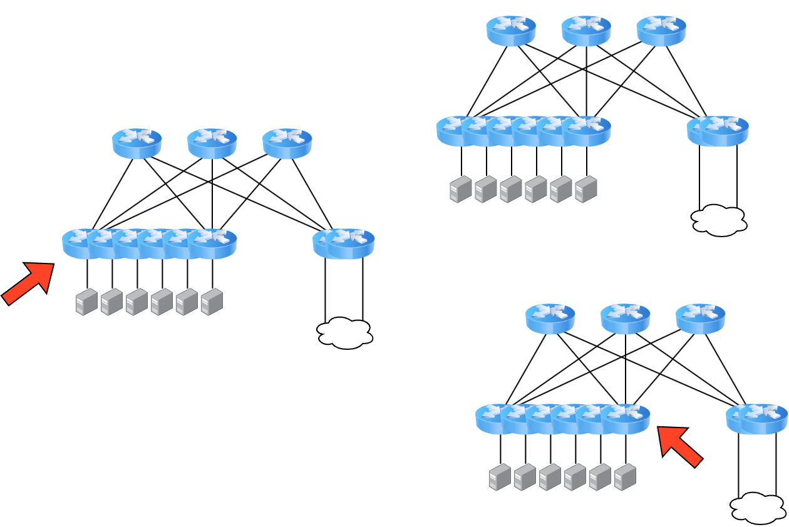
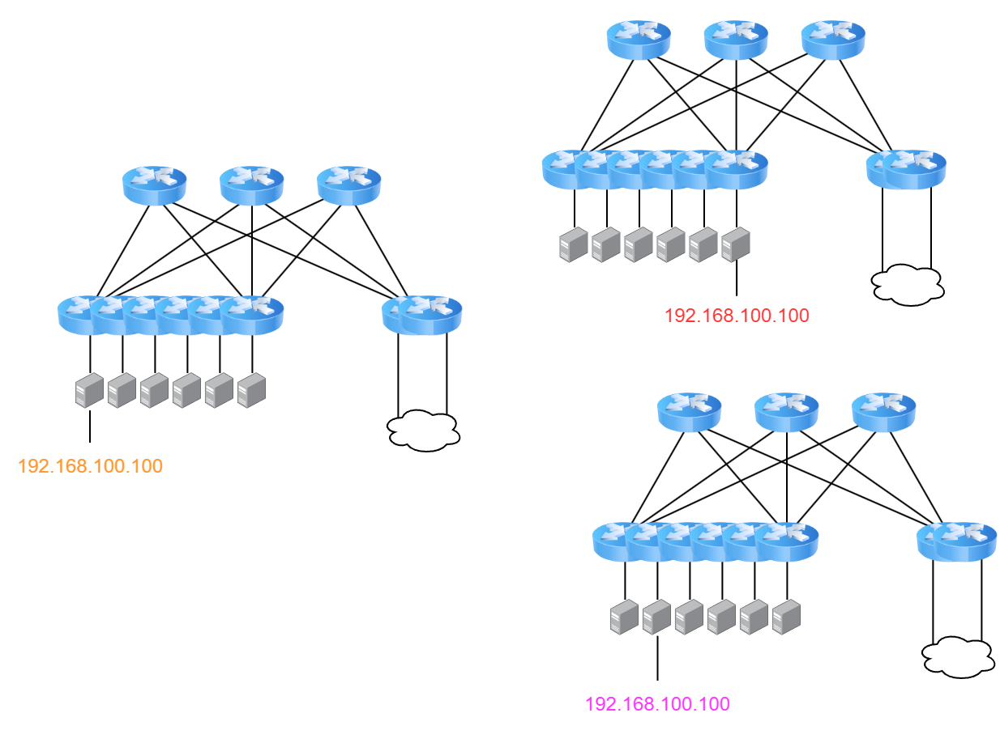

class: center, middle

<div class="my-header"></div>

.image-40[]
# The 16-bit Datacenter
Brandon Ewing<br />
CHI-NOG 10, Oct 2022<br />
[www.github.com/bewing/chinog-10](https://www.github.com/bewing/chinog-10/)

???
* Thank the PC
* intro self
* reducing complexitiy in datacenter configuration
* complexity means more data collection and entry
* more touches means more opportunity for error

TODO:  Better image

---
<div class="my-header"><h1>Talk Contents</h1></div>
<br />
.row.table.middle[
.col-6[
<div style="
        border-radius: 100%;
        width: 400px;
        aspect-ratio: 1;
        background: conic-gradient(red 0deg 144deg, green 144deg 288deg, orange 240deg 360deg
            );
    "></div>
]
.col-6[
.big.red[40% Knowledge Transfer]<p>
.big.green[40% Stuff to think about]<br />
]]

--

.row.table.middle[
.col-6[&nbsp;]
.col-6[
.big.orange[20% Please tell me he's not doing that in prod]<br />
]
]

---
class: middle
<div class="my-header"><h1>Simplicity</h1></div>
.image-40[]

???
Simple, Spine/Leaf datacenter with service leaves

---
class: full, middle, center
background-image: url(assets/months_later.png)

---
class: middle

<div class="my-header"><h1>Complexity</h1></div>
.image-60[]

???
Datacenters spread across regions
different deploy times
different hardware
even different vendors!
---

<div class="my-header"><h1>Complexity</h1></div>

.image-60[]

---

<div class="my-header"><h1>Complexity</h1></div>

.image-60[]

--

```terminal
$ wc -l configs/DC1-LEAF1
2130 configs/DC1-LEAF1
$ git diff --color --stat --no-index configs/DC1-LEAF1 configs/DC4-LEAF9
 configs/{DC1-LEAF1 => DC4-LEAF9} | 881 <span style="color:lime;"> +++++++++ </span><span style="color:red;">-----------</span>
 
 1 file changed, 362 insertions(+), 519 deletions(-)

```

---
class: middle

<div class="my-header"><h1>Baseline</h1></div>

* Use templates
* Same templates for provisioning and configuration
* If you aren't pushing configs, at least run audits
* Clean up cruft!

???
Templating language doesn't matter<br />
I'm using gomplate from containerlab here

---
class: inverse
<div class="my-header"><h1>Context</h1></div>

```yaml
nodes:
- hostname: dc1-leaf1
  router-id: 172.18.4.10
  region: dc1
  role: leaf
  aaa:
  - 192.168.3.2
  - 192.168.10.1
  - 192.168.14.10
  addresses:
    Loopback0:
      ipv4:
      - 172.18.4.10/32
      ipv6:
      - "2001:db8::1/128"
    Ethernet1/1:
      ipv4:
      - 10.0.0.0/31
      ipv6:
      - "2001:2b8:1::1/64"
  bgp:
    asn: "65534"
    ipv4:
      peer-groups:
      - name: SPINE-LEAF
        outbound-policy: SPINE-TO-LEAF
        inbound-policy: LEAF-TO-SPINE
        neighbors:
        - address: 10.0.0.1
          asn: TODO
  dns:
    search: warningg.com
    servers:
    - 8.8.8.8
```

---
class:middle, center
.big[
```terminal
$ stat --format "%s" host.yaml
608
```
]
--
class: inverse

.big[
608 bytes > 16 bits
]

---
class: middle
<div class="my-header"><h1>Boilerplate</h1></div>

.table[
.row[
.col-6[
.big[DC1-LEAF4]
]
.col-6[
.big[DC4-LEAF9]
]
]
.row[
.col-6[
```terminal
<span style="color:red;">-ip nameserver 192.168.0.0</span>
<span style="color:red;">-ip nameserver 192.168.100.100</span>
!
<span style="color:red;">-tacacs-server 192.168.3.2</span>
tacacs-server 192.168.10.1
<span style="color:red;">-tacacs-server 192.168.14.10</span>

```
]
.col-6[
```terminal
<span style="color:green;">+ip nameserver 10.240.0.0</span>
<span style="color:green;">+ip nameserver 10.244.100.100</span>
!
<span style="color:green;">+tacacs-server 192.168.14.10</span>
tacacs-server 192.168.10.1
<span style="color:green;">+tacacs-server 192.168.3.2</span>
```
]
]
]
* Anycast when possible
 * Make sure your application withdraws itself if not healthy
 * Avoid ECMP through policy
* Global services with fallbacks if not
 * If RTT is important, programatticaly order them

???
You don't have to golf if you don't want to

---
class: middle
<div class="my-header"><h1>Boilerplate</h1></div>

.image-60[]


---

```yaml
nodes:
- hostname: dc1-leaf1
  router-id: 172.18.4.10
  region: dc1
  role: leaf
  addresses:
    Loopback0:
      ipv4:
      - 172.18.4.10/32
      ipv6:
      - "2001:db8::1/128"
    Ethernet1/1:
      ipv4:
      - 10.0.0.0/31
      ipv6:
      - "2001:2b8:1::1/64"
  bgp:
    asn: "65534"
    ipv4:
      peer-groups:
      - name: SPINE-LEAF
        outbound-policy: SPINE-TO-LEAF
        inbound-policy: LEAF-TO-SPINE
        neighbors:
        - address: 10.0.0.1
          asn: TODO
```

---
# Don't Repeat Yourself
* What if we could omit/derive some of these fields?
* Router ID as the base

--

.row.table.middle[
.col-3[
.center[172]
]
.col-3[
.center[18]
]
.col-3[
.center[4]
]
.col-3[
.center[10]
]]
.row.table.middle[
.col-3[
.center[10101100]
]
.col-3[
.center[00010010]
]
.col-3[
.center[00000100]
]
.col-3[
.center[00001010]
]]

---
# Don't Repeat Yourself
* What if we could omit/derive some of these fields?
* Router ID as the base

.row.table.middle[
.col-8[
4
]
.col-3[
10
]]
.row.table.middle[
.col-2[
.orange[00]
]
.col-2[
.green[00]
]
.col-2[
.red[01]
]
.col-2[
.purple[00]
]
.col-6[
.purple[00001010]
]]

.row.table.middle[
.col-2[
.orange[Region]
]
.col-2[
.green[Site]
]
.col-2[
.red[Layer]
]
.col-3[
.purple.center[Device]
]
]

---

# Don't Repeat Yourself
* What if we could omit/derive some of these fields?
* Router ID as the base
* Generate the IPv6 loopback, too!

.big[
2001:db8::/64 + 172.18.4.10/32<p />
.col-6[2001:db8::172.18.4.10]
.col-6[2001:db8::ac12:40ac]
]
---
# Don't Repeat Yourself
* What if we could omit/derive some of these fields?
* Router ID as the base
* Generate the IPv6 loopback, too!
* BGP ASN?  Sure!
<br />

.center[.big[<16 bits>.<16 bits>]]

--

.center[65000 . (4 * 256) + 10 ]
<br />
.center[.big[65000.1034]]

--

.row.table[
.col-6[
* Why 16 bits?
 * IPv4
 * BGP ASN space
]
.col-6[
.orange[This is one of those 20% parts]
]
]

---
class: middle
# 32-bit joke image

---
class: inverse
<div class="my-header"><h1>Context</h1></div>

```yaml
nodes:
- router-id: 172.18.4.10
  addresses:
    Ethernet1/1:
      ipv4:
      - 10.0.0.0/31
      ipv6:
      - "2001:2b8:1::1/64"
  bgp:
    ipv4:
      peer-groups:
      - name: SPINE-LEAF
        outbound-policy: SPINE-TO-LEAF
        inbound-policy: LEAF-TO-SPINE
        neighbors:
        - address: 10.0.0.1
          asn: TODO
```

---
class: middle
<div class="my-header"><h1>Interfaces</h1></div>

.table[
.row[
.col-6[
DC1-LEAF4
]
.col-6[
DC4-LEAF9
]
]
.row[
.col-6[
```terminal
interface Ethernet49/1
<span style="color:red;">-  description DC1-SPINE1:Et5/1</span>
  no switchport
<span style="color:red;">-  ip address 10.0.0.0/31</span>
<span style="color:red;">-  ipv6 address 2001:db8::ffff:0a00:0/127</span>
  pim ipv4 sparse-mode
  pim ipv6 sparse-mode
```
]
.col-6[
```terminal
interface Ethernet 49/1
<span style="color:green;">+  description DC4-SPINE3:Et5/1</span>
  no switchport
<span style="color:green;">+  ip address 10.5.49.22/31</span>
<span style="color:green;">+  ipv6 address 2001:db8::ffff:a05:3116/127</span>
  pim ipv4 sparse-mode
  pim ipv6 sparse-mode
```
]
]
]

.row.table.middle[
.col-6[
```terminal
router bgp 65000.TODO
  neighbor SPINES-v4 peer-group
  neighbor SPINES-v6 peer-group
<span style="color:red;">-  neighbor 10.0.0.1 peer-group SPINES-v4</span>
<span style="color:red;">-  neighbor 10.0.0.1 remote-as 65000.TODO</span>
<span style="color:red;">-  neighbor 2001:db8:ffff:0a00:1 peer-group SPINES-v6</span>
<span style="color:red;">-  neighbor 2001:db8:ffff:0a00:1 remote-as 65000.TODO</span>
  address-family ipv4 unicast
    peer-group SPINES-v4 activate
    no peer-group SPINES-v6 activate
  !
  address-family ipv6 unicast
    no peer-group SPINES-v4 activate
    peer-group SPINES-v6 activate
  !
!
```
]
.col-6[
```terminal
router bgp 65000.TODO
  neighbor SPINES-v4 peer-group
  neighbor SPINES-v6 peer-group
<span style="color:green;">+  neighbor TODO peer-group SPINES-v4</span>
<span style="color:green;">+  neighbor TODO remote-as TODO</span>
<span style="color:green;">+  neighbor TODO peer-group SPINES-v6</span>
<span style="color:green;">+  neighbor TODO remote-as TODO</span>
  address-family ipv4 unicast
    peer-group SPINES-v4 activate
    no peer-group SPINES-v6 activate
  !
  address-family ipv6 unicast
    no peer-group SPINES-v4 activate
    peer-group SPINES-v6 activate
  !
!
```
]
]

---
class: middle
<div class="my-header"><h1>Interfaces</h1></div>

* [RFC5549](https://datatracker.ietf.org/doc/html/rfc5549) - IPv4 NLRI in IPv6 Peering
* * Allows IPv4 reachability over just IPv6 peerings
* * No longer need IPv4 BGP peerings
* * No longer need IPv4 point to point interfaces!

```terminal
interface Ethernet49/1
  ipv6 address 2001:db8::ffff:0a00:0/127
  pim ipv4 sparse-mode
  pim ipv6 sparse-mode
!
router bgp 6500.16394
  neighbor SPINES peer-group
  neighbor 2001:db8::ffff:0a00:1/127 peer-group SPINES
  neighbor 2001:db8::ffff:0a00:1/127 remote-as TODO
  address-family ipv4 unicast
    bgp next-hop address-family ipv6
    neighbor SPINES activate
    neighbor SPINES next-hop address-family ipv6 originate
  !
  address-family ipv6 unicast
    neighbor SPINES activate
  !
!
```

---
class: middle
<div class="my-header"><h1>But wait, there's more!</h1></div>

* [draft-white-linklocal-capability](https://datatracker.ietf.org/doc/draft-white-linklocal-capability/)
* Widely supported across vendors
* Standardizes existing practice of BGP peering via link-local IPv6 addresses
* Now we don't need any globally unique addressing!

```terminal
interface Ethernet49/1
  ipv6 address fe80::0/64
  pim ipv4 sparse-mode
  pim ipv6 sparse-mode
!
router bgp 6500.16394
  neighbor SPINES peer-group
  neighbor fe80::1%Ethernet49/1 peer-group SPINES
  neighbor fe80::1%Ethernet49/1 remote-as TODO
  address-family ipv4 unicast
    bgp next-hop address-family ipv6
    neighbor SPINES activate
    neighbor SPINES next-hop address-family ipv6 originate
  !
  address-family ipv6 unicast
    neighbor SPINES activate
  !
!
```

---
class: middle

<div class="my-header"><h1>BGP Peerings</h1></div>
* BGP Peer autodetection
* Multiple IETF IDR WG proposals (see [draft-ietf-idr-bgp-autoconf-considerations](https://datatracker.ietf.org/doc/draft-ietf-idr-bgp-autoconf-considerations/02/))
* Some Layer2 (LLDP), some Layer3
* Some are secured, some aren't
* Some are stateful, some are stateless
* No real consensus yet
* Trying to support all DC use cases

---
class: middle
<div class="my-header"><h1>BGP Peerings</h1></div>

* More than one vendor supports IPv6 link-local peer autodetection
* Uses IPv6 RAs to identify routers on an interface
* No current RFC or I-D for this behavior
* There may be interoperability issues

```terminal
interface Ethernet49/1
  ipv6 enable
  pim ipv4 sparse-mode
  pim ipv6 sparse-mode
!
router bgp 65000.16394
  neighbor SPINES peer-group
  neighbor interface Ethernet49/1 peer-group SPINES peer-filter SPINES
  address-family ipv4 unicast
    bgp next-hop address-family ipv6
    neighbor SPINES activate
    neighbor SPINES next-hop address-family ipv6 originate
  !
  address-family ipv6 unicast
    neighbor SPINES activate
  !
!
```

---
class: middle
<div class="my-header"><h1>BGP Peerings</h1></div>
* Neighborships can specify AS ranges
* Still have to statically map a policy to an interface
 * While we can predict this in our lab, production isn't as nice
* What would be great is if remote AS determined policy
* Ask your vendor if this is something they can support
* May require stronger security ([RFC 5925 TCP-AO](https://datatracker.ietf.org/doc/html/rfc5925))

---
class: middle

```yaml
nodes:
- router-id: 172.18.64.1
- router-id: 172.18.64.2
- router-id: 172.18.64.3
- router-id: 172.18.128.4
- router-id: 172.18.128.5
- router-id: 172.18.192.6
- router-id: 172.18.0.7
```

---
class:middle
<div class="my-header"><h1>Hosts</h1></div>
* If your virtualization and tenancy model supports it, go deeper!
* Assign hosts router-ids
 * Deployment
 * Custom DHCP
* Advertise reachability via host-based BGP
 * GoBGP
 * FRR
* IPv6 LL RA Supported!
 
---
class:middle
<div class="my-header"><h1>Hosts</h1></div>

```terminal
router bgp 65000.16394
  neighbor SPINES peer-group
  neighbor SERVERS peer-group
  neighbor interface Ethernet1-48 peer-group SERVERS peer-filter SERVERS
  neighbor interface Ethernet49/1-52/4 peer-group SPINES peer-filter SPINES
  address-family ipv4 unicast
    bgp next-hop address-family ipv6
    neighbor SERVERS activate
    neighbor SERVERS next-hop address-family ipv6 originate
    neighbor SPINES activate
    neighbor SPINES next-hop address-family ipv6 originate
  !
  address-family ipv6 unicast
    neighbor SERVERS activate
    neighbor SPINES activate
  !
!
```

---
# Time-constraint:  C-lab Demo?
# Config review?


---
# TODO: Wrap
