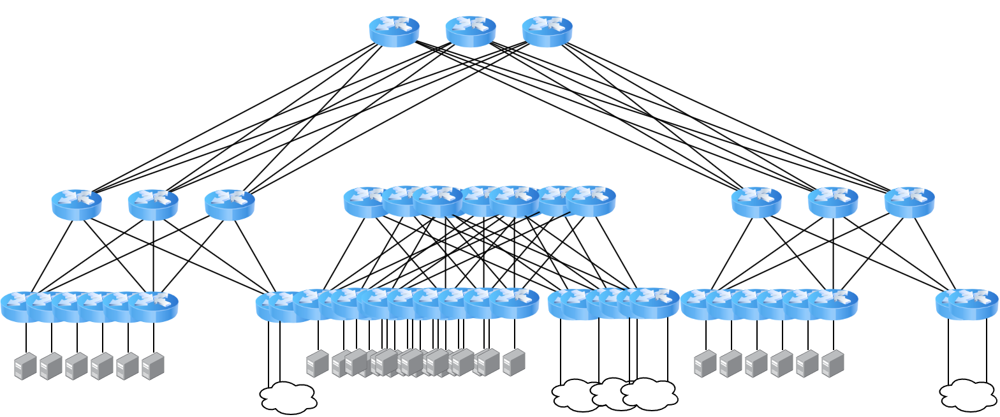

title: The 16-bit Datacenter
layout: true

---
class: center, middle

<div class="my-header"></div>

.image-50[]
# {{ title }}
Brandon Ewing<br />
CHI-NOG 10, Oct 2022

???
TODO:  Better image

---
class: middle
<div class="my-header"><h1>Complexity</h1></div>
.row.table.top[
.col-3[
### Simplicity
]
.col-5[
.image-80[]
]]

???
Simple, Spine/Leaf datacenter with service leaves

---
<div class="my-header"><h1>Complexity</h1></div>

.image-60[]

---
<div class="my-header"><h1>Complexity</h1></div>
<br />
.image-60[]

---
class: middle

<div class="my-header"><h1>Complexity</h1></div>
.row.table.top[
.col-3[
### Redundancy
]
.col-5[
.image-70[]
]]

---

<div class="my-header"><h1>Complexity</h1></div>
<br />
<br />
.image-60[]

---
class: middle

<div class="my-header"><h1>Complexity</h1></div>
.image-60[]

---

<div class="my-header"><h1>Complexity</h1></div>
<br />
<br />
# TODO: image for virality

---
class: middle

<div class="my-header"><h1>Complexity</h1></div>

.image-100[]

---

<div class="my-header"><h1>Complexity</h1></div>

.image-60[]

---

<div class="my-header"><h1>Complexity</h1></div>

.image-60[]

--

```terminal
$ git diff --color --stat --no-index configs/DC1-LEAF1 configs/DC4-LEAF9
 configs/{DC1-LEAF1 => DC4-LEAF9} | 881 <span style="color:lime;"> +++++++++ </span><span style="color:red;">-----------</span>
 
 1 file changed, 362 insertions(+), 519 deletions(-)

```
