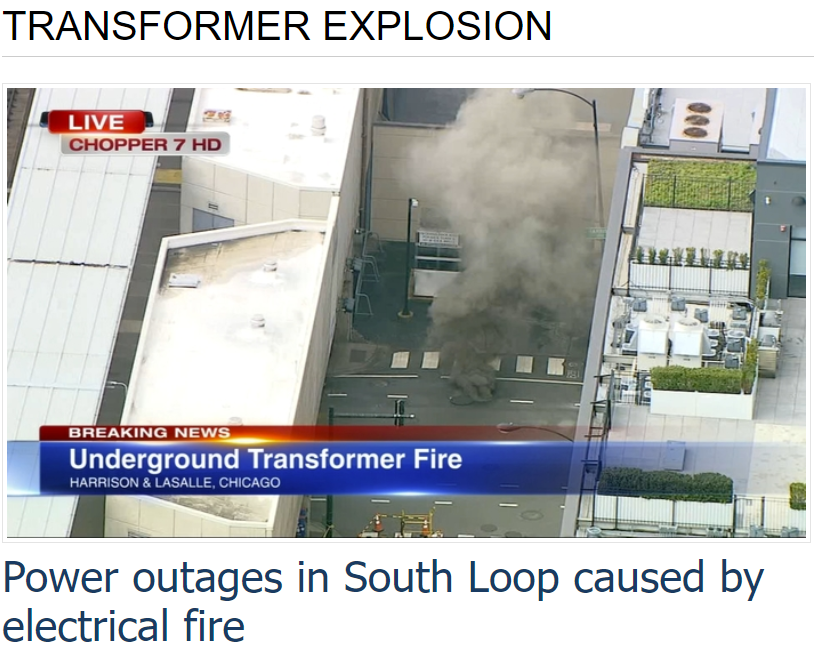
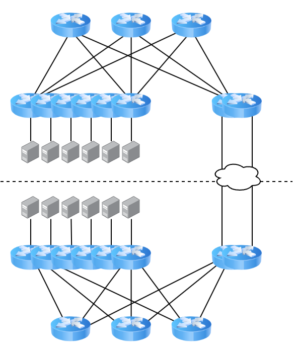
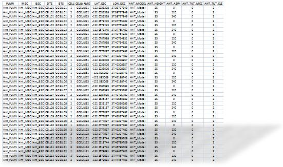

---
class: center, middle

<div class="my-header"></div>

.image-40[]
# The 16-bit Datacenter
Brandon Ewing<br />
CHI-NOG 10, Oct 2022<br />
[www.github.com/bewing/chinog-10](https://www.github.com/bewing/chinog-10/)

???
* Thank the PC
* intro self
* reducing complexitiy in datacenter configuration
* complexity means more data collection and entry
* more touches means more opportunity for error

TODO:  Better image

---
<div class="my-header"><h1>Talk Contents</h1></div>
<br />
.row.table.middle[
.col-6[
<div style="
        border-radius: 100%;
        width: 400px;
        aspect-ratio: 1;
        background: conic-gradient(red 0deg 144deg, green 144deg 288deg, orange 240deg 360deg
            );
    "></div>
]
.col-6[
.big.red[Knowledge Transfer]<br />
.big.green[Stuff to think about]<br />
]]

--

.row.table.middle[
.col-6[&nbsp;]
.col-6[
.big.orange[Please tell me he's not doing that in prod]<br />
]
]

---
class: middle
<div class="my-header"><h1>Complexity</h1></div>
.row.table.top[
.col-3[
### Simplicity
]
.col-5[
.image-80[]
]]

???
Simple, Spine/Leaf datacenter with service leaves

---
<div class="my-header"><h1>Complexity</h1></div>
<br />
.image-60[]

???
May 2020 Transformer fire near Coresite datacenter

---
class: middle

<div class="my-header"><h1>Complexity</h1></div>
.row.table.top[
.col-3[
### Redundancy
]
.col-5[
.image-70[]
]]

---

<div class="my-header"><h1>Complexity</h1></div>
<br />
<br />
.image-60[]

???
Management/spreadsheets don't do things twice
They do them N-times

---
class: middle

<div class="my-header"><h1>Complexity</h1></div>
.image-60[]

???
Datacenters spread across regions
different deploy times
different hardware
even different vendors!
---

<div class="my-header"><h1>Complexity</h1></div>

.image-60[]

---

<div class="my-header"><h1>Complexity</h1></div>

.image-60[]

--

```terminal
$ wc -l configs/DC1-LEAF1
2130 configs/DC1-LEAF1
$ git diff --color --stat --no-index configs/DC1-LEAF1 configs/DC4-LEAF9
 configs/{DC1-LEAF1 => DC4-LEAF9} | 881 <span style="color:lime;"> +++++++++ </span><span style="color:red;">-----------</span>
 
 1 file changed, 362 insertions(+), 519 deletions(-)

```

---
class: middle

<div class="my-header"><h1>Baseline</h1></div>

* Use templates
* Same templates for provisioning and configuration
* If you aren't pushing configs, at least run audits
* Clean up cruft!

???
Templating language doesn't matter<br />
I'm using gomplate from containerlab here

---
<div class="my-header"><h1>Baseline</h1></div>

```yaml
hosts:
- hostname: dc1-spine1
  region: dc1
  role: spine
  router-id: 172.18.0.1
  aaa:
  - 192.168.3.2
  - 192.168.10.1
  - 192.168.14.10
  addresses:
    Loopback0:
      ipv4:
      - 172.18.0.1/32
      ipv6:
      - "2001:db8::1/128"
    Ethernet1/1:
      ipv4:
      - 10.0.0.0/31
      ipv6:
      - "2001:2b8:1::1/64"
  bgp:
    asn: "65500.16394"
    ipv4:
      peer-groups:
      - name: SPINE-LEAF
        outbound-policy: SPINE-TO-LEAF
        inbound-policy: LEAF-TO-SPINE
        neighbors:
        - address: 10.0.0.1
          asn: TODO
  dns:
    search: warningg.com
    servers:
    - 8.8.8.8
- hostname: dc2-leaf1
```

---
# DRY
* What if we could omit/derive some of these fields?
* What is a router-id, anyway?

--

.row.table.middle[
.col-3[
172
]
.col-3[
18
]
.col-3[
64
]
.col-3[
10
]]
.row.table.middle[
.col-3[
10101100
]
.col-3[
00010010
]
.col-3[
01000000
]
.col-3[
00001010
]]

---
# DRY
* What if we could omit/derive some of these fields?
* What is a router-id, anyway?

.row.table.middle[
.col-3[
172
]
.col-3[
18
]
.col-3[
64
]
.col-3[
10
]]
.row.table.middle[
.col-3[
10101100
]
.col-3[
00010010
]
.col-3[
.orange[01].green[00].red[00].purple[00]
]
.col-3[
.purple[00001010]
]]

.row.table.middle[
.col-6[

]
.col-1[
.orange[Region]
]
.col-1[
.green[Site]
]
.col-1[
.red[Layer]
]
.col-1[
.purple[Device]
]
]


---
# DRY
* What if we could omit/derive some of these fields?
* What is a router-id, anyway?
* What is a BGP ASN?
<br />

.center[.big[<16 bits>.<16 bits>]]

--

.center[65000 . (64 * 256) + 10 ]
<br />
.center[.big[65000.16394]]

* Why 16 bits?
--

* * IPv4
* * BGP ASN space

---
class: middle
# 32-bit joke image

---

```yaml
hosts:
- hostname: dc1-spine1
  router-id: 172.18.0.1
  aaa:
  - 192.168.3.2
  - 192.168.10.1
  - 192.168.14.10
  addresses:
    Loopback0:
      ipv6:
      - "2001:db8::1/128"
    Ethernet1/1:
      ipv4:
      - 10.0.0.0/31
      ipv6:
      - "2001:2b8:1::1/64"
  bgp:
    ipv4:
      peer-groups:
      - name: SPINE-LEAF
        outbound-policy: SPINE-TO-LEAF
        inbound-policy: LEAF-TO-SPINE
        neighbors:
        - address: 10.0.0.1
          asn: TODO
  dns:
    search: warningg.com
    servers:
    - 8.8.8.8
```
---

class: middle
<div class="my-header"><h1>Boilerplate</h1></div>

.row.table.middle[
.col-6[
```terminal
<span style="color:red;">ip nameserver 192.168.0.0</span>
<span style="color:red;">ip nameserver 192.168.100.100</span>
!
<span style="color:red;">tacacs-server 192.168.3.2</span>
<span style="color:red;">tacacs-server 192.168.10.1</span>
<span style="color:red;">tacacs-server 192.168.14.10</span>

```
]
.col-6[
```terminal
<span style="color:green;">ip nameserver 192.168.100.100</span>
<span style="color:green;">ip nameserver 192.168.0.0</span>
!
<span style="color:green;">tacacs-server 192.168.14.10</span>
<span style="color:green;">tacacs-server 192.168.10.1</span>
<span style="color:green;">tacacs-server 192.168.3.2</span>
```
]
]
* Anycast where possible
* * Be careful about TACACS sessions and the like
* Global services with fallbacks if not
* * If RTT is important, dynamically order them

???
You don't have to golf if you don't want to


---

```yaml
hosts:
- hostname: dc1-spine1
  router-id: 172.18.0.1
  addresses:
    Loopback0:
      ipv6:
      - "2001:db8::1/128"
    Ethernet1/1:
      ipv4:
      - 10.0.0.0/31
      ipv6:
      - "2001:2b8:1::1/64"
  bgp:
    ipv4:
      peer-groups:
      - name: SPINE-LEAF
        neighbors:
        - address: 10.0.0.1
          asn: TODO
```
---
class: middle
<div class="my-header"><h1>Interfaces</h1></div>

.row.table.middle[
.col-6[
```terminal
interface Ethernet49/1
<span style="color:red;">  description DC1-SPINE1:Et5/1</span>
  no switchport
<span style="color:red;">  ip address 10.0.0.0/31</span>
<span style="color:red;">  ipv6 address 2001:db8::ffff:0a00:0/127</span>
  pim ipv4 sparse-mode
  pim ipv6 sparse-mode
```
]
.col-6[
```terminal
interface Ethernet 49/1
<span style="color:green;">  description DC4-SPINE3:Et5/1</span>
  no switchport
<span style="color:green;">  ip address 10.5.49.22/31</span>
<span style="color:green;">  ipv6 address 2001:db8::ffff:a05:3116/127</span>
  pim ipv4 sparse-mode
  pim ipv6 sparse-mode
```
]
]

.row.table.middle[
.col-6[
```terminal
router bgp 65000.TODO
  neighbor SPINES-v4 peer-group
  neighbor SPINES-v6 peer-group
<span style="color:red;">  neighbor 10.0.0.1 peer-group SPINES-v4</span>
<span style="color:red;">  neighbor 10.0.0.1 remote-as 65000.TODO</span>
<span style="color:red;">  neighbor 2001:db8:ffff:0a00:1 peer-group SPINES-v6</span>
<span style="color:red;">  neighbor 2001:db8:ffff:0a00:1 remote-as 65000.TODO</span>
  address-family ipv4 unicast
    peer-group SPINES-v4 activate
    no peer-group SPINES-v6 activate
  !
  address-family ipv6 unicast
    no peer-group SPINES-v4 activate
    peer-group SPINES-v6 activate
  !
!
```
]
.col-6[
```terminal
router bgp 65000.TODO
  neighbor SPINES-v4 peer-group
  neighbor SPINES-v6 peer-group
<span style="color:green;">  neighbor TODO peer-group SPINES-v4</span>
<span style="color:green;">  neighbor TODO remote-as TODO</span>
<span style="color:green;">  neighbor TODO peer-group SPINES-v6</span>
<span style="color:green;">  neighbor TODO remote-as TODO</span>
  address-family ipv4 unicast
    peer-group SPINES-v4 activate
    no peer-group SPINES-v6 activate
  !
  address-family ipv6 unicast
    no peer-group SPINES-v4 activate
    peer-group SPINES-v6 activate
  !
!
```
]
]

---
class: middle
<div class="my-header"><h1>Interfaces</h1></div>

* [RFC5549](https://datatracker.ietf.org/doc/html/rfc5549) - IPv4 NLRI in IPv6 Peering
* * Allows IPv4 reachability over just IPv6 peerings
* * No longer need IPv4 BGP peerings
* * No longer need IPv4 point to point interfaces!

```terminal
interface Ethernet49/1
  ipv6 address 2001:db8::ffff:0a00:0/127
  pim ipv4 sparse-mode
  pim ipv6 sparse-mode
!
router bgp 6500.16394
  neighbor SPINES peer-group
  neighbor 2001:db8::ffff:0a00:1/127 peer-group SPINES
  neighbor 2001:db8::ffff:0a00:1/127 remote-as TODO
  address-family ipv4 unicast
    bgp next-hop address-family ipv6
    neighbor SPINES activate
    neighbor SPINES next-hop address-family ipv6 originate
  !
  address-family ipv6 unicast
    neighbor SPINES activate
  !
!
```

---
class: middle
<div class="my-header"><h1>But wait, there's more!</h1></div>

* [draft-white-linklocal-capability](https://datatracker.ietf.org/doc/draft-white-linklocal-capability/)
* Widely supported across vendors
* Standardizes existing practice of BGP peering via link-local IPv6 addresses
* Now we don't need any globally unique addressing!

```terminal
interface Ethernet49/1
  ipv6 address fe80::0/64
  pim ipv4 sparse-mode
  pim ipv6 sparse-mode
!
router bgp 6500.16394
  neighbor SPINES peer-group
  neighbor fe80::1%Ethernet49/1 peer-group SPINES
  neighbor fe80::1%Ethernet49/1 remote-as TODO
  address-family ipv4 unicast
    bgp next-hop address-family ipv6
    neighbor SPINES activate
    neighbor SPINES next-hop address-family ipv6 originate
  !
  address-family ipv6 unicast
    neighbor SPINES activate
  !
!
```

---
class: middle

<div class="my-header"><h1>Here be dragons</h1></div>
* BGP Peer autodetection
* Multiple IETF IDR WG proposals (see [draft-ietf-idr-bgp-autoconf-considerations](https://datatracker.ietf.org/doc/draft-ietf-idr-bgp-autoconf-considerations/02/))
* Some Layer2 (LLDP), some Layer3
* Some are secured, some aren't
* Some are stateful, some are stateless
* No real consensus yet
* Trying to support all DC use cases

---
class: middle
<div class="my-header"><h1>Until that happens...</h1></div>

* More than one vendor supports IPv6 link-local peer autodetection
* Uses IPv6 RAs to identify routers on an interface
* No current RFC or I-D for this behavior
* There may be interoperability issues

```terminal
interface Ethernet49/1
  ipv6 enable
  pim ipv4 sparse-mode
  pim ipv6 sparse-mode
!
router bgp 65000.16394
  neighbor SPINES peer-group
  neighbor interface Ethernet49/1 peer-group SPINES peer-filter SPINES
  address-family ipv4 unicast
    bgp next-hop address-family ipv6
    neighbor SPINES activate
    neighbor SPINES next-hop address-family ipv6 originate
  !
  address-family ipv6 unicast
    neighbor SPINES activate
  !
!
```

---
class: middle

```yaml
hosts:
- hostname: dc1-spine1
  router-id: 172.18.0.1
- hostname: dc1-spine2
  router-id: 172.18.0.2
- hostname: dc1-spine3
  router-id: 172.18.0.3
- hostname: dc1-leaf1
  router-id: 172.18.64.1
- hostname: dc1-leaf2
  router-id: 172.18.64.2
- hostname: dc2-superspine1
  router-id: 172.18.192.0
```

---
# TODO:  Hosts


--
# TODO: Wrap
